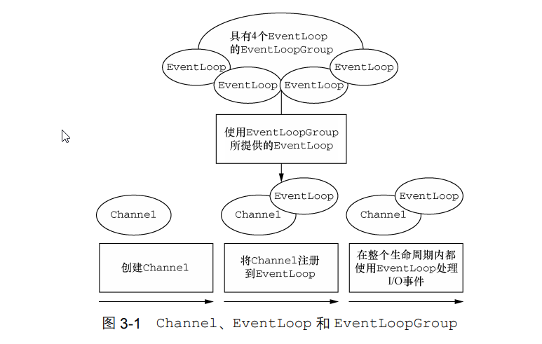
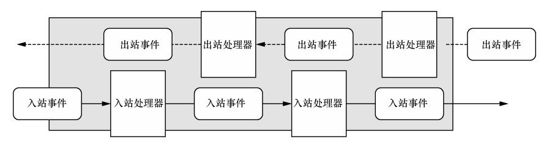
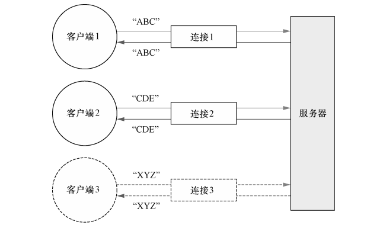

# netty简介
Netty 是一款异步的事件驱动的网络应用程序框架，支持快速地开发可维护的高性能的面向协议的服务器和客户端。

# netty 核心组件

## Channel
Channel 是 Java NIO 的一个基本构造。它代表一个到实体（如一个硬件设备、一个文件、一个网络套接字或者一个能够执行一个或者多个不同的I/O操作的程序组件）的开放连接，如读操作和写操作。可以把Channel 看作是传入（入站）或者传出（出站）数据的载体。因此，它可以被打开或者被关闭，连接或者断开连接。
Netty 的 Channel 接口,提供一组API,将原生的socket的bind()、connect()、read()和 write()等封装起来,大大地降低了直接使用 Socket 类的复杂性。Netty中主要有以下击中Channel:
* EmbeddedChannel: EmbeddedChannel仅仅是模拟入站与出站的操作，底层不进行实际传输，不需要启动Netty服务器和客户端。使用EmbeddedChannel，开发人员可以在单元测试用例中方便、快速地进行ChannelHandler业务处理器的单元测试。
* LocalServerChannel: 用于本地的transport
* NioDatagramChannel: 处理UDP协议 
* NioSctpChannel: 处理Sctp协议
* NioSocketChannel:处理TCP协议

## EventLoop
EventLoop 定义了 Netty 的核心抽象，用于处理连接的生命周期中所发生的事件。Channel、EventLoop、Thread 以及 EventLoopGroup 之间的关系:

* 一个 EventLoopGroup 包含一个或者多个 EventLoop；
* 一个 EventLoop 在它的生命周期内只和一个 Thread 绑定；
* 所有由 EventLoop 处理的 I/O 事件都将在它专有的 Thread 上被处理；
* 一个 Channel 在它的生命周期内只注册于一个 EventLoop；
* 一个 EventLoop 可能会被分配给一个或多个 Channel。


## Future/ChannelFuture
Future 提供了另一种在操作完成时通知应用程序的方式。这个对象可以看作是一个异步操作的结果的占位符；它将在未来的某个时刻完成，并提供对其结果的访问。Netty 中所有的 I/O 操作都是异步的。因为一个操作可能不会立即返回，所以我们需要一种用于在之后的某个时间点确定其结果的方法。为此，Netty 提供了ChannelFuture 接口，其 addListener()方法注册了一个 ChannelFutureListener，以便在某个操作完成时（无论是否成功）得到通知。


## ChannelHandler 和 ChannelPipeline
Netty 使用不同的事件来通知我们状态的改变或者是操作的状态。这使得我们能够基于已经发生的事件来触发适当的动作,如记录日志、数据转换、流控制、应用程序逻辑等。每个事件都可以被分发给 ChannelHandler 类中的某个用户实现的方法。Netty 的 ChannelHandler 为处理器提供了基本的抽象，Netty 提供了大量预定义的可以开箱即用的 ChannelHandler 实现，包括用于各种协议（如 HTTP 和 SSL/TLS）的 ChannelHandler。

Netty 是一个网络编程框架，所以事件是按照它们与入站或出站数据流的相关性进行分类的。可能由入站数据或者相关的状态更改而触发的事件包括：
* 连接已被激活或者连接失活
* 数据读取
* 用户事件
* 错误事件 

出站事件是未来将会触发的某个动作的操作结果，这些动作包括：
* 打开或者关闭到远程节点的连接；
* 将数据写到或者冲刷到套接字。



ChannelPipeline 提供了 ChannelHandler 链的容器，并定义了用于在该链上传播入站和出站事件流的 API。当 Channel 被创建时，它会被自动地分配到它专属的 ChannelPipeline。ChannelHandler 安装到 ChannelPipeline 中的过程如下所示：
* 一个ChannelInitializer的实现被注册到了ServerBootstrap中；
* 当 ChannelInitializer.initChannel()方法被调用时，ChannelInitializer将在 ChannelPipeline 中安装一组自定义的 ChannelHandler；
* ChannelInitializer 将它自己从 ChannelPipeline 中移除。

```java
public class EchoServer {
//    .......
public void start() throws Exception {
    final EchoServerHandler serverHandler = new EchoServerHandler();
    EventLoopGroup group = new NioEventLoopGroup();
    ServerBootstrap bootstrap = new ServerBootstrap();
    try{
        bootstrap.group(group).channel(NioServerSocketChannel.class)
                .localAddress(new InetSocketAddress(port)).childHandler(serverHandler).childHandler(
                new ChannelInitializer<SocketChannel>() {
                    @Override
                    protected void initChannel(SocketChannel socketChannel) throws Exception { //当一个新的连接被接受时，一个新的子 Channel 将会被创建，而 ChannelInitializer 将会把一个你的EchoServerHandler 的实例添加到该 Channel 的 ChannelPipeline 中
                        socketChannel.pipeline().addLast(serverHandler);// pipeline 链式处理消息
                    }
                }
        );
        ChannelFuture future = bootstrap.bind().sync();
        future.channel().closeFuture().sync();
    }catch (Exception e){

    }finally {
        group.shutdownGracefully().sync();
    }
}
}
```

### ChannelInboundHandler
接收入站事件和数据，这些数据随后将会被你的应用程序的业务逻辑所处理。当你要给连接的客户端发送响应时，也可以从 ChannelInboundHandler 冲刷数据。

[核心API](https://juejin.cn/post/6995719947045306404)
```java 
public interface ChannelInboundHandler extends ChannelHandler {

    /**
     当通道注册完成后，Netty会调用fireChannelRegistered()方法，触发通道注册事件，而在通道流水线注册过的入站处理器的channelRegistered()回调方法会被调用。
     */
    void channelRegistered(ChannelHandlerContext ctx) throws Exception;

    /**
     * 当通道激活完成后，Netty会调用fireChannelActive()方法，触发通道激活事件，而在通道流水线注册过的入站处理器的channelActive()回调方法会被调用。
     */
    void channelUnregistered(ChannelHandlerContext ctx) throws Exception;

     /**
     * 当通道激活完成后，Netty会调用fireChannelActive()方法，触发通道激活事件，而在通道流水线注册过的入站处理器的channelActive()回调方法会被调用。
     */
    void channelActive(ChannelHandlerContext ctx) throws Exception;

    /**
     * 当连接被断开或者不可用时，Netty会调用fireChannelInactive()方法，触发连接不可用事件，而在通道流水线注册过的入站处理器的channelInactive()回调方法会被调用。
     */
    void channelInactive(ChannelHandlerContext ctx) throws Exception;

    /**
     当通道缓冲区可读时，Netty会调用fireChannelRead()方法，触发通道可读事件，而在通道流水线注册过的入站处理器的channelRead()回调方法会被调用，以便完成入站数据的读取和处理。
     */
    void channelRead(ChannelHandlerContext ctx, Object msg) throws Exception;

    /**
     * 当通道缓冲区读完时，Netty会调用fireChannelReadComplete()方法，触发通道缓冲区读完事件，而在通道流水线注册过的入站处理器的channelReadComplete()回调方法会被调用。
     */
    void channelReadComplete(ChannelHandlerContext ctx) throws Exception;

    /**
     * 如果触发了用户事件，则被调用。
     */
    void userEventTriggered(ChannelHandlerContext ctx, Object evt) throws Exception;

    /**
     * 一旦Channel的可写状态改变，就会被调用。可以使用Channel.isWritable()检查状态。
     */
    void channelWritabilityChanged(ChannelHandlerContext ctx) throws Exception;

    /**
     * 异常回调
     */
    @Override
    @SuppressWarnings("deprecation")
    void exceptionCaught(ChannelHandlerContext ctx, Throwable cause) throws Exception;
}
```

### ChannelOutboundHandler
[核心API](https://juejin.cn/post/6995719947045306404)
```java
public interface ChannelOutboundHandler extends ChannelHandler {
    /**
    监听地址（IP+端口）绑定：完成底层Java IO通道的IP地址绑定。如果使用TCP传输协议，这个方法用于服务端。
     */
    void bind(ChannelHandlerContext ctx, SocketAddress localAddress, ChannelPromise promise) throws Exception;

    /**
      连接服务端：完成底层Java IO通道的服务端的连接操作。如果使用TCP传输协议，那么这个方法将用于客户端。
     */
    void connect(
            ChannelHandlerContext ctx, SocketAddress remoteAddress,
            SocketAddress localAddress, ChannelPromise promise) throws Exception;

    /**
     * 断开服务器连接：断开底层Java IO通道的socket连接。如果使用TCP传输协议，此方法主要用于客户端。
     *
     */
    void disconnect(ChannelHandlerContext ctx, ChannelPromise promise) throws Exception;

    /**
     * 主动关闭通道：关闭底层的通道，例如服务端的新连接监听通道。
     */
    void close(ChannelHandlerContext ctx, ChannelPromise promise) throws Exception;

    /**
   从当前注册的EventLoop进行取消注册操作后调用。
     */
    void deregister(ChannelHandlerContext ctx, ChannelPromise promise) throws Exception;

    /**
     * 从底层读数据：完成Netty通道从Java IO通道的数据读取。
     */
    void read(ChannelHandlerContext ctx) throws Exception;

    /**
    * 写数据到底层：完成Netty通道向底层Java IO通道的数据写入操作。此方法仅仅是触发一下操作，并不是完成实际的数据写入操作。
     */
    void write(ChannelHandlerContext ctx, Object msg, ChannelPromise promise) throws Exception;

    /**
     * 将底层缓存区的数据腾空，立即写出到对端。
     */
    void flush(ChannelHandlerContext ctx) throws Exception;
}
```

## Bootstrap 和 ServerBootstrap

# 代码实例
实现如下图所示的server端和client端：


## server
所有的 Netty 服务器都需要以下两部分。
* 至少一个ChannelHandler: 该组件实现了服务器对从客户端接收的数据的处理，即它的业务逻辑。
* 引导(bootstrap):这是配置服务器的启动代码。至少，它会将服务器绑定到它要监听连接请求的端口上。

引导过程中所需要的步骤如下：
* 创建一个 ServerBootstrap 的实例以引导和绑定服务器；
* 创建并分配一个 NioEventLoopGroup 实例以进行事件的处理，如接受新连接以及读/写数据；
* 指定服务器绑定的本地的 InetSocketAddress；
* 使用一个 EchoServerHandler 的实例初始化每一个新的 Channel；
* 调用 ServerBootstrap.bind()方法以绑定服务器。

```java
public class EchoServer {
    private static int port;

    public EchoServer(int port){
        this.port = port;
    }
    public void start() throws Exception {
        final EchoServerHandler serverHandler = new EchoServerHandler();
        EventLoopGroup group = new NioEventLoopGroup();
        ServerBootstrap bootstrap = new ServerBootstrap();
        try{
            bootstrap.group(group).channel(NioServerSocketChannel.class)
                    .localAddress(new InetSocketAddress(port)).childHandler(serverHandler).childHandler(
                    new ChannelInitializer<SocketChannel>() {
                        @Override
                        protected void initChannel(SocketChannel socketChannel) throws Exception { //当一个新的连接被接受时，一个新的子 Channel 将会被创建，而 ChannelInitializer 将会把一个你的EchoServerHandler 的实例添加到该 Channel 的 ChannelPipeline 中
                            socketChannel.pipeline().addLast(serverHandler);// pipeline 链式处理消息
                        }
                    }
            );
            ChannelFuture future = bootstrap.bind().sync();
            future.channel().closeFuture().sync();
        }catch (Exception e){

        }finally {
            group.shutdownGracefully().sync();
        }

    }

    public static void main(String[] args) {
        if (args.length !=1){
            System.err.println("Usage: " + EchoServer.class.getSimpleName() + " <port>");
            return;
        }
        int port = Integer.parseInt(args[0]);
        try {
            new EchoServer(port).start();
        } catch (Exception e) {
            e.printStackTrace();
        }
    }
}
```

### client

* 为初始化客户端，创建了一个 Bootstrap 实例；
* 为进行事件处理分配了一个 NioEventLoopGroup 实例，其中事件处理包括创建新的连接以及处理入站和出站数据；
* 为服务器连接创建了一个 InetSocketAddress 实例；
* 当连接被建立时，一个 EchoClientHandler 实例会被安装到（该 Channel 的）ChannelPipeline 中；
* 在一切都设置完成后，调用 Bootstrap.connect()方法连接到远程节点；


### 回调
一个回调其实就是一个方法，一个指向已经被提供给另外一个方法的方法的引用。这使得后者可以在适当的时候调用前者。回调在广泛的编程场景中都有应用，而且也是在操作完成后通知相关方最常见的方式之一。
Netty 在内部使用了回调来处理事件；当一个回调被触发时，相关的事件可以被一个 interfaceChannelHandler 的实现处理。